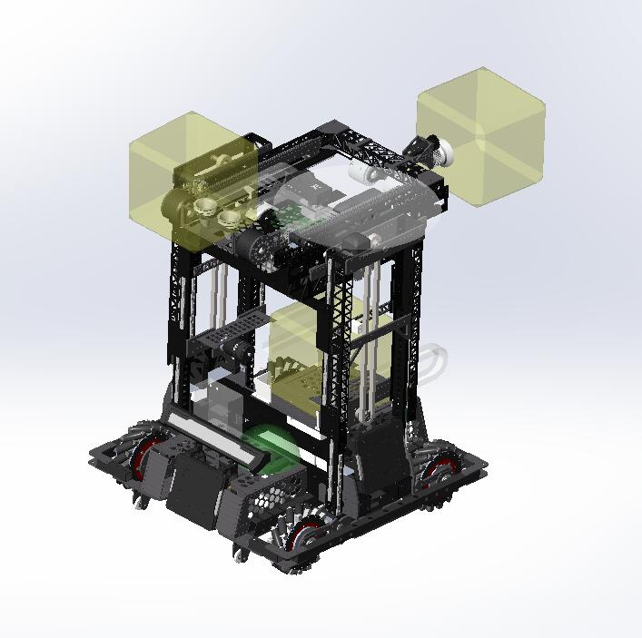

# BlackPink 粉墨
2023 RM Engineering Team 3SE Southeast University 

2023 RoboMater 工程 东南大学3SE战队
 

## 参与贡献
Txy Sxm Sxk Wjt

## 硬件架构
#### 主板：STM32F427IIH6(A板)
- 双板通信(Uart)
- Gimbal_Gyro(Uart):维特智能WT931
- Gimbal_Motor(RS485):海泰DMR4315
- ArmYaw_Motor(RS485):瓴控MG4005
  
  
* PlatformL_Encoder(CAN):维特智能JY_ME02
* PlatformR_Encoder(CAN):维特智能JY_ME02
* SkyPitchL_Motor(CAN):大疆GM6020
* SkyPitchR_Motor(CAN):大疆GM6020
* PlatformL_Motor(CAN):大疆GM3508
* PlatformR_Motor(CAN):大疆GM3508
  
  
* ArmPitchL_Motor(CAN):达妙DMJ4310
* ArmPitchR_Motor(CAN):达妙DMJ4310
* ArmRoll_Motor(CAN):大疆GM2006
* SkyForwardL_Motor(CAN):大疆GM2006
* SkyForwardR_Motor(CAN):大疆GM2006

#### 从板：STM32F407IGH6TR(C板)

- Chassis_Motor(CAN) * 4:大疆GM3508
- LiftL_Motor(CAN):大疆GM3508
- LiftR_Motor(CAN):大疆GM3508

## 软件架构
BSP:外设相关函数
  
Motion:任务中执行的动作函数
  
Task:任务

## 操作实现
操作手操作主要分为两大部分：空接臂模式、兑换臂模式，每大部分下各分抓取模式和兑换模式。
  
操作手可控制的模式包括空接臂抓取模式、空接臂兑换模式、兑换臂抓取模式、兑换臂兑换模式。

#### 空接臂抓取模式
手动模式：
  
&nbsp;&nbsp;&nbsp;&nbsp;&nbsp;&nbsp;小陀螺
  
&nbsp;&nbsp;&nbsp;&nbsp;&nbsp;&nbsp;手动小资源岛
  
&nbsp;&nbsp;&nbsp;&nbsp;&nbsp;&nbsp;手动大资源岛
  
&nbsp;&nbsp;&nbsp;&nbsp;&nbsp;&nbsp;防御功能
  
自动模式：
  
&nbsp;&nbsp;&nbsp;&nbsp;&nbsp;&nbsp;自动空接
  
&nbsp;&nbsp;&nbsp;&nbsp;&nbsp;&nbsp;自动保持（小资源岛、大资源岛）*（允许手动模式不同情况抓取的矿石随车运动不干涉）*
  
&nbsp;&nbsp;&nbsp;&nbsp;&nbsp;&nbsp;自动交递 *（矿石从空接臂换到兑换臂）*
  

#### 空接臂兑换模式
手动模式：
  
&nbsp;&nbsp;&nbsp;&nbsp;&nbsp;&nbsp;抬升微调
  
&nbsp;&nbsp;&nbsp;&nbsp;&nbsp;&nbsp;空接臂前伸微调
  
&nbsp;&nbsp;&nbsp;&nbsp;&nbsp;&nbsp;空接臂吸盘开合
  

#### 兑换臂抓取模式
手动模式：
  
&nbsp;&nbsp;&nbsp;&nbsp;&nbsp;&nbsp;小陀螺
  
&nbsp;&nbsp;&nbsp;&nbsp;&nbsp;&nbsp;手动地矿
  
&nbsp;&nbsp;&nbsp;&nbsp;&nbsp;&nbsp;手动小资源岛
  
自动模式：
  
&nbsp;&nbsp;&nbsp;&nbsp;&nbsp;&nbsp;自动小资源岛
  
&nbsp;&nbsp;&nbsp;&nbsp;&nbsp;&nbsp;自动取出 *（从车体存矿系统取出矿石）*
  
&nbsp;&nbsp;&nbsp;&nbsp;&nbsp;&nbsp;自动保持（地矿、小资源岛）*（允许手动模式不同情况抓取的矿石随车运动不干涉）*
  
&nbsp;&nbsp;&nbsp;&nbsp;&nbsp;&nbsp;自动存矿 *（小资源岛矿石存入存矿系统）*
  

#### 兑换臂兑换模式
手动模式：
  
&nbsp;&nbsp;&nbsp;&nbsp;&nbsp;&nbsp;小陀螺
  
&nbsp;&nbsp;&nbsp;&nbsp;&nbsp;&nbsp;抬升微调
  
&nbsp;&nbsp;&nbsp;&nbsp;&nbsp;&nbsp;平台微调
  
&nbsp;&nbsp;&nbsp;&nbsp;&nbsp;&nbsp;兑换臂Pitch轴微调
  
&nbsp;&nbsp;&nbsp;&nbsp;&nbsp;&nbsp;兑换臂Roll轴微调
  
&nbsp;&nbsp;&nbsp;&nbsp;&nbsp;&nbsp;兑换臂Yaw轴微调、云台微调
  
&nbsp;&nbsp;&nbsp;&nbsp;&nbsp;&nbsp;兑换臂吸盘开合
  
&nbsp;&nbsp;&nbsp;&nbsp;&nbsp;&nbsp;沿吸盘方向运动
  

自动部分：
  
&nbsp;&nbsp;&nbsp;&nbsp;&nbsp;&nbsp;&nbsp;&nbsp;操作手按下对应按键进入自动流程，根据机构状态判断是否实现对应动作，过程中操作手可在特定位置按下按键实现流程继续，否则机构处于当前位置等待。为防止机构自动过程中出现无法预知的卡顿，设置按键。操作手按下该按键自动跳转至下一姿态。
手动部分：
  
&nbsp;&nbsp;&nbsp;&nbsp;&nbsp;&nbsp;&nbsp;&nbsp;操作手通过控制调节机器人档位，不同档位对应不同的平台高度和不同的按键含义，举例如下：
- *按键A允许机器人档位变化，按下按键A机器人机器人档位变化（平台高度上升）：初始档&rarr;地矿档&rarr;小资源岛&rarr;大资源岛*  
- *按键B允许机器人档位变化，按下按键B机器人机器人档位变化（平台高度下降）：大资源岛&rarr;小资源岛&rarr;地矿档&rarr;初始档*
- *按键C机器人平台左右、前伸、Pitch轴运动（初步到位）、吸盘开启，按下按键C机器人根据档位控制前平台左右、前伸、Pitch轴、吸盘情况*
- *按键D机器人平台高度或前伸微调（由档位确定微调机构），如：大资源岛、小资源岛微调前伸，地矿档微调平台高度*
- *按键E机器人收回伸出机构，根据档位判定机构姿态，进入自动流程，同时在机构姿态满足情况下还能对矿石进行存储*
  

以抓取大资源岛举例如下：
 

- 机器人位于初始档位，按按键A，机器人档位变化：初始档&rarr;地矿档
- 机器人位于地矿档位，按按键A，机器人档位变化：地矿档&rarr;小资源岛   
- 机器人位于小资源岛档位，按按键A，机器人档位变化：小资源岛&rarr;大资源岛   
- 机器人位于大资源岛档位，按按键C，机器人平台前移、前伸伸出、pitch轴翻转、吸盘打开，到达抓取大资源岛初始位置
- 按按键D，按下D时机器人前伸继续缓慢向前移动，使吸盘能够吸紧矿石，松开D键，前伸回到抓取大资源岛初始位置
- 按按键E，按下E时如果机器人机构伸出则回到自动保持姿势，再按按键E，如位于保持姿势机器人执行存储矿石自动流程